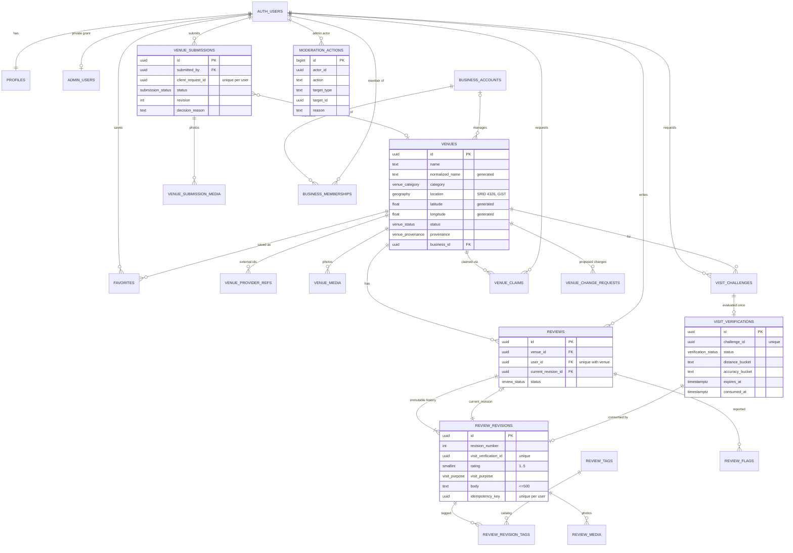

# ERD

```mermaid
erDiagram
    AUTH_USERS ||--|| PROFILES : "has"
    AUTH_USERS ||--o| ADMIN_USERS : "private grant"
    AUTH_USERS ||--o{ FAVORITES : saves
    VENUES ||--o{ FAVORITES : "saved as"
    VENUES ||--o{ VENUE_PROVIDER_REFS : "external ids"
    VENUES ||--o{ VENUE_MEDIA : photos
    AUTH_USERS ||--o{ VENUE_SUBMISSIONS : submits
    VENUE_SUBMISSIONS ||--o{ VENUE_SUBMISSION_MEDIA : photos
    VENUE_SUBMISSIONS }o--o| VENUES : "approved_as / duplicate_of"
    AUTH_USERS ||--o{ VISIT_CHALLENGES : requests
    VENUES ||--o{ VISIT_CHALLENGES : "for"
    VISIT_CHALLENGES ||--o| VISIT_VERIFICATIONS : "evaluated once"
    VENUES ||--o{ REVIEWS : has
    AUTH_USERS ||--o{ REVIEWS : writes
    REVIEWS ||--|{ REVIEW_REVISIONS : "immutable history"
    REVIEWS |o--|| REVIEW_REVISIONS : "current_revision"
    VISIT_VERIFICATIONS ||--o| REVIEW_REVISIONS : "consumed by"
    REVIEW_REVISIONS ||--o{ REVIEW_REVISION_TAGS : tagged
    REVIEW_TAGS ||--o{ REVIEW_REVISION_TAGS : "catalog"
    REVIEW_REVISIONS ||--o{ REVIEW_MEDIA : photos
    REVIEWS ||--o{ REVIEW_FLAGS : "reported"
    BUSINESS_ACCOUNTS ||--o{ BUSINESS_MEMBERSHIPS : members
    AUTH_USERS ||--o{ BUSINESS_MEMBERSHIPS : "member of"
    BUSINESS_ACCOUNTS |o--o{ VENUES : manages
    VENUES ||--o{ VENUE_CLAIMS : "claimed via"
    AUTH_USERS ||--o{ VENUE_CLAIMS : requests
    VENUES ||--o{ VENUE_CHANGE_REQUESTS : "proposed changes"
    AUTH_USERS ||--o{ MODERATION_ACTIONS : "admin actor"

    VENUES {
        uuid id PK
        text name
        text normalized_name "generated"
        venue_category category
        geography location "SRID 4326, GiST"
        float latitude "generated"
        float longitude "generated"
        venue_status status
        venue_provenance provenance
        uuid business_id FK
    }
    VENUE_SUBMISSIONS {
        uuid id PK
        uuid submitted_by FK
        uuid client_request_id "unique per user"
        submission_status status
        int revision
        text decision_reason
    }
    VISIT_VERIFICATIONS {
        uuid id PK
        uuid challenge_id "unique"
        verification_status status
        text distance_bucket
        text accuracy_bucket
        timestamptz expires_at
        timestamptz consumed_at
    }
    REVIEWS {
        uuid id PK
        uuid venue_id FK
        uuid user_id FK "unique with venue"
        uuid current_revision_id FK
        review_status status
    }
    REVIEW_REVISIONS {
        uuid id PK
        int revision_number
        uuid visit_verification_id "unique"
        smallint rating "1..5"
        visit_purpose visit_purpose
        text body "<=500"
        uuid idempotency_key "unique per user"
    }
    MODERATION_ACTIONS {
        bigint id PK
        uuid actor_id
        text action
        text target_type
        uuid target_id
        text reason
    }
```

`VISIT_CHALLENGES`, `VISIT_VERIFICATIONS`, `ADMIN_USERS`, `APP_SETTINGS` and `ANALYTICS_EVENTS` live in the non-exposed `private` schema.
